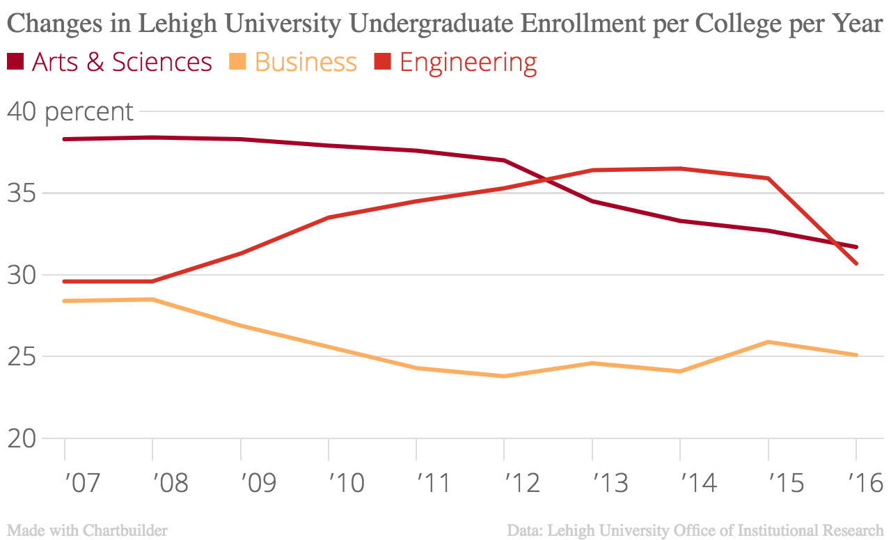

Hi, I'm Emily, a sophomore at Lehigh University. An Oregon native, I flew out to Pennsylvania to play on the softball team and study journalism here. So far, I'm loving absolutely every minute of it. I spend most of my time with my team, but when I'm not playing catch with my [favorite group of people](http://lehighsports.com/roster.aspx?path=softball), I'm usually paging through design inspirations with a steaming cup of coffee in hand. Feel free to [follow me on instagram](https://www.instagram.com/emilypreble/) to keep up with my newest adventures. 

Below, you'll find some of my latest work from various classes and outside projects. 

### Infographics

**Home Sweet Home: Where are Lehigh Undergraduates Living?**

Here, I used Canva to create a brief infographic about the makeup of Lehigh Undergraduate residency. The data from Lehigh's Office of Institutional Research demonstrated that a majority of undergrads live either in a dorm or off-campus house. 

**Bottoms Up: The Top 10 Coffee Consuming Nations**

My love of coffee inspired me to take a closer look at where the USA fell in a list of the top ten coffee consuming nations. As listed by worldatlas.com, we don't even crack the top 10! Nevertheless, the data is interestingly close and divided by cups (a standard 8 ounce cup used for a baseline) of coffee a day each country drinks on average. Canva was again used to design this infographic.

### Timelines

**Getting Ready in Rio: A look at the 2016 Summer Olympic Games**

This is a timeline of the 2016 Summer Olympic Games in Rio de Janeiro. The visualization was created with TimelineJS; to view, simply click through the slides and read about the societal progression of concern to success in the Rio Games. 

<iframe src='https://cdn.knightlab.com/libs/timeline3/latest/embed/index.html?source=1S_Z2lrVkhSAc6L3s88ydJ9DT3unQPMf3tszMiaXQkTU&font=Default&lang=en&initial_zoom=2&height=650' width='100%' height='650' webkitallowfullscreen mozallowfullscreen allowfullscreen frameborder='0'></iframe>

**In a League of Her Own: A glimpse at the career of Dottie Kamenshek**

Softball has been a part of my life for as long as I can remember. Before I even knew how to swing a bat properly, I knew every word to the movie "A League of Their Own." Here is a closer look at the life of Dottie Kamenshek, a loose model for my favorite character, Dottie Hinson. Data retrieved from [Brittanica.](https://www.britannica.com/biography/Dorothy-Kamenshek)

<iframe src='https://cdn.knightlab.com/libs/timeline3/latest/embed/index.html?source=1jDYRWYWMy1D9ki3qNu581ATBA1UVdDrMJZtOCdkBaOI&font=Default&lang=en&initial_zoom=2&height=650' width='100%' height='650' webkitallowfullscreen mozallowfullscreen allowfullscreen frameborder='0'></iframe>

### Charts

**Undergraduate Enrollment Distribution at Lehigh University**

This chart depicts the distribution of Lehigh Undergraduates per college. Data provided by [Lehigh's Office of Institutional Research](http://www.lehigh.edu/~oir/profiles/profile_files/LUprofile_2016.pdf). The graphic itself was created on Chartbuilder.  

**Changes in Lehigh University Undergraduate Enrollment per College per Year**

This chart illustrates the change in percentages of undergraduate enrollment at Lehigh University. Data retrieved from [Lehigh's Office of Institutional Research](http://www.lehigh.edu/~oir/profiles/profile_files/LUprofile_2016.pdf) and graphic again created on Chartbuilder. 

**Change in the Number of Wins and Losses for the Lehigh Softball Program per Season**

As a member of the Lehigh softball program, I thought it would be interesting to see the fluctuation of wins and losses of my team over the last 10 years. This graph depicts the wins, in blue, and the losses, in red, of the team per season. Data provided by the [NCAA](http://web1.ncaa.org/stats/StatsSrv/careersearch). 

### Maps

**Mapping Local Lehigh Valley Arts Centers**
This map displays local Lehigh Valley Art Centers, complete with an address, website URL, and image. Simply click each icon to learn more about each art center.

<iframe width="1000" height="600" scrolling="no" frameborder="no" src="https://fusiontables.google.com/embedviz?q=select+col0+from+1Lccw3eO7OhOu5-EDChyNy9Qxwy6GqetcvWOGv4fJ&amp;viz=MAP&amp;h=false&amp;lat=40.611763851291606&amp;lng=-75.37083326796875&amp;t=1&amp;z=15&amp;l=col0&amp;y=2&amp;tmplt=2&amp;hml=ONE_COL_LAT_LNG"></iframe>
